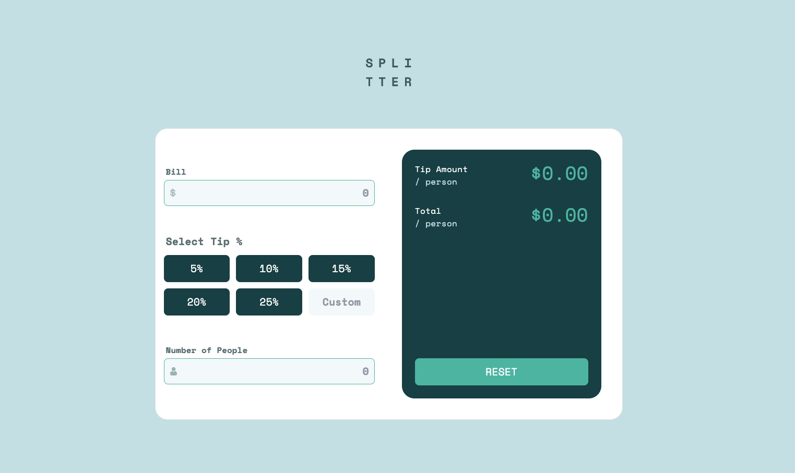
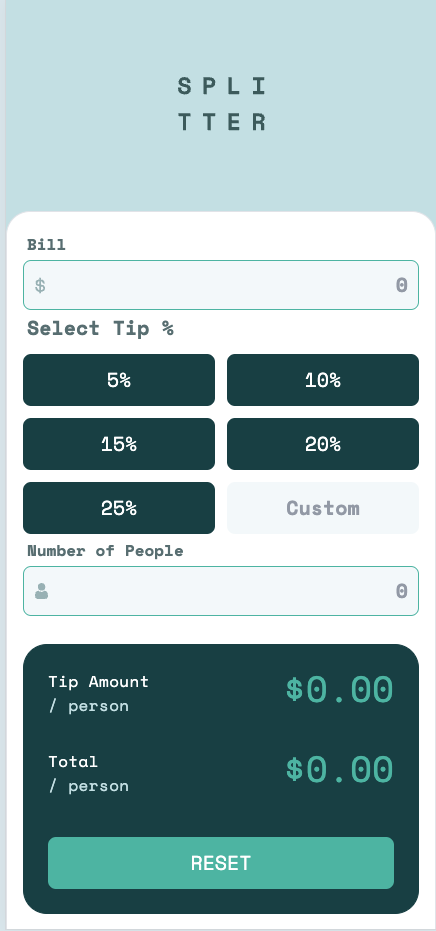

# Frontend Mentor - Tip calculator app solution

This is a solution to the [Tip calculator app challenge on Frontend Mentor](https://www.frontendmentor.io/challenges/tip-calculator-app-ugJNGbJUX).

## Table of contents

- [Overview](#overview)
  - [The challenge](#the-challenge)
  - [Screenshot](#screenshot)
  - [Links](#links)
- [My process](#my-process)
  - [Built with](#built-with)
  - [What I learned](#what-i-learned)
  - [Continued development](#continued-development)
  - [Useful resources](#useful-resources)
- [Author](#author)
- [Acknowledgments](#acknowledgments)

**Note: Delete this note and update the table of contents based on what sections you keep.**

## Overview

### The challenge

Users should be able to:

- View the optimal layout for the app depending on their device's screen size
- See hover states for all interactive elements on the page
- Calculate the correct tip and total cost of the bill per person

### Screenshot




### Links

- Solution URL: (https://github.com/tobaojo/tip-calculator-app)
- Live Site URL: (https://tranquil-kheer-9da4c7.netlify.app/)

## My process

### Built with

- Semantic HTML5 markup
- Tailwind
- React (Vite)
- Typescript
- React-testing library
- [React](https://reactjs.org/) - JS library

### What I learned

    1.	Focus on Behavior Over Implementation in Testing:
    •	Tests should verify the behavior that users experience, not how the behavior is implemented internally.
    •	Avoid testing internal state, specific methods, or setState calls directly.
    •	Instead, simulate user actions (e.g., clicks, typing) and assert observable outcomes.
    2.	What to Test with React Testing Library:
    •	Ensure components render correctly with the expected UI and structure.
    •	Simulate user interactions (e.g., clicks, form submissions) and verify the results.
    •	Test accessibility using roles, labels, and descriptions.
    •	Check conditional rendering and state-dependent UI updates.
    3.	Mocking and Simulating Functions:
    •	Use mocks (e.g., vi.fn() in Vitest) to test whether callbacks are invoked and with the correct arguments.
    •	For instance, simulate a button click and confirm the handler function is called the expected number of times.
    4.	Example of Behavior Testing:
    •	A button click should trigger a handler function like resetHandler.
    •	Mock the handler, simulate the click, and assert that the handler is called.

```js
const resetHandler = vi.fn();
fireEvent.click(screen.getByText("RESET"));
expect(resetHandler).toHaveBeenCalledTimes(1);
```

### Continued development

I would like to continue to learn more about testing react products with unit, intergration and E2E tests

**Note: Delete this note and the content within this section and replace with your own plans for continued development.**

### Useful resources

- [Example resource 1](https://www.example.com) - This helped me for XYZ reason. I really liked this pattern and will use it going forward.
- [Example resource 2](https://www.example.com) - This is an amazing article which helped me finally understand XYZ. I'd recommend it to anyone still learning this concept.

**Note: Delete this note and replace the list above with resources that helped you during the challenge. These could come in handy for anyone viewing your solution or for yourself when you look back on this project in the future.**

## Author

- Website - [Add your name here](https://www.your-site.com)
- Frontend Mentor - [@tobaojo](https://www.frontendmentor.io/profile/tobaojo)
